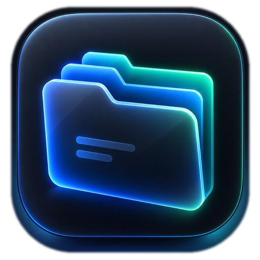

<div align="center">
  
  
  # Storage Organizer - Intelligent Desktop Storage Optimization and File Management System

  **High performance local storage analysis, content-based deduplication, and automated organization for Windows.**

  [](https://github.com/BeginnerAman/StorageOrganizer/releases)
  [](https://beginneraman.github.io/StorageOrganizer/)
  [](https://github.com/BeginnerAman/StorageOrganizer)
  [](https://github.com/BeginnerAman/StorageOrganizer)
  [](LICENSE)
  [](https://github.com/BeginnerAman/StorageOrganizer/releases)
  [](https://github.com/BeginnerAman/StorageOrganizer)
  [](https://github.com/BeginnerAman/StorageOrganizer/releases)
  [](https://github.com/BeginnerAman/StorageOrganizer/stargazers)

  ### *The ultimate offline storage management utility for Windows - clean disk space, eliminate duplicates, and organize messy folders with zero cloud telemetry and zero risk.*

  <p align="center">
    <a href="https://beginneraman.github.io/StorageOrganizer/"><strong>Official Website and Documentation</strong></a>
    &nbsp;&bull;&nbsp;
    <a href="https://github.com/BeginnerAman/StorageOrganizer/releases/tag/v3.27.8"><strong>Download v3.27.8</strong></a>
    &nbsp;&bull;&nbsp;
    <a href="https://github.com/BeginnerAman/StorageOrganizer/issues"><strong>Report Issue</strong></a>
  </p>
</div>

---

> [!NOTE]
> For interactive feature demonstrations, detailed documentation, and instant downloads, visit the official project website at [beginneraman.github.io/StorageOrganizer](https://beginneraman.github.io/StorageOrganizer/).

---

## Features

| Capability | Technical Specification |
| :--- | :--- |
| **Deep Storage Analysis** | Scans drives and folders at rapid speeds, indexing file sizes, mime categories, directory depth, and creation/modification timestamps. |
| **Smart Classification** | Automatically groups files into structured directories: Media, Pictures, Documents, Code, Archives, Audio, and Executables. |
| **MD5 Duplicate Detection** | Two-stage hashing pipeline (byte size match followed by full MD5 check) ensures zero false positives when finding redundant copies. |
| **Junk and Cache Cleaner** | Identifies orphaned temporary files, build caches, log files, editor backups, and zero-byte ghost files safely. |
| **Dry-Run Preview Safety** | Generates an interactive visual plan of all proposed actions before moving or deleting a single file. Nothing executes without user approval. |
| **1-Click Rollback Engine** | Maintains a persistent SQLite transaction database of every executed action. Any operation can be reverted to its original location instantly. |
| **Custom Filter Rules** | Create tailored automation rules with extension matching, regular expressions, size thresholds, and file age conditions. |
| **Native Desktop Shell** | Unified frameless dark window built with Microsoft Edge Chromium runtime. Consumes less than 60 MB RAM with instantaneous window controls. |
| **100 Percent Offline and Private** | Operates entirely on your local machine. No external API calls, no background analytics, and zero cloud telemetry. |

---

## Download

| Package | Specification | Direct Download Link |
| :--- | :--- | :--- |
| **Standalone Executable (.exe)** | Single file binary. No installation or Python setup required. | [Download StorageOrganizer.exe](https://github.com/BeginnerAman/StorageOrganizer/releases/download/v3.27.8/StorageOrganizer.exe) |
| **Portable Archive (.zip)** | Zero-install portable folder. Extract and launch immediately. | [Download StorageOrganizer-Portable.zip](https://github.com/BeginnerAman/StorageOrganizer/releases/download/v3.27.8/StorageOrganizer-Portable.zip) |

---

## Quick Start

1. **Download:** Grab `StorageOrganizer.exe` or `StorageOrganizer-Portable.zip` from [Releases](https://github.com/BeginnerAman/StorageOrganizer/releases) or the [Official Website](https://beginneraman.github.io/StorageOrganizer/).
2. **Launch:** Double-click the executable to launch the native desktop application.
3. **Analyze and Clean:** Select any folder or hard drive partition, review the categorized audit, and organize your storage with confidence.

---

## Tech Stack

* **Core Engine:** Python 3.13, Flask 3.0 WSGI Server (Localhost daemon)
* **Desktop Shell:** PyWebView 6.x with Microsoft Edge Chromium (WebView2)
* **Frontend:** Semantic HTML5, Modular CSS3, ES6 JavaScript, Space Mono and DM Sans typography
* **Packaging:** PyInstaller single-file compiler with optimized binary footprint (~18 MB)
* **Storage and Safety:** Thread-safe JSON configuration, SHA-256 session logging, atomic file rollback

---

## Architecture

```
+-----------------------------------------------------------------------+
|              Storage Organizer Desktop Native Application             |
|                                                                       |
|  +---------------------------+       +-----------------------------+  |
|  | Modern Frameless UI       | <===> | PyWebView EdgeChromium Core |  |
|  | (HTML5 / CSS3 / Vanilla)  |  IPC  | (WindowControlsAPI Bridge)  |  |
|  +---------------------------+       +-----------------------------+  |
|               ^                                     ^                 |
|               | HTTP Loopback                       | System Hooks    |
|               v                                     v                 |
|  +---------------------------+       +-----------------------------+  |
|  | Flask WSGI Background     |       | OS Native File System       |  |
|  | Application Controller    | <===> | - Deep Scanner Engine       |  |
|  | - Scan / Category Routes  |       | - Two-Phase MD5 Detector    |  |
|  | - Rules / Config Manager  |       | - Junk Pattern Recognizer   |  |
|  | - Rollback Database API   |       | - Atomic File Organizer     |  |
|  +---------------------------+       +-----------------------------+  |
+-----------------------------------------------------------------------+
```

---

## System Requirements

* **Operating System:** Windows 10 (64-bit) or Windows 11 (64-bit)
* **Runtime:** Microsoft Edge WebView2 Runtime (Pre-installed on modern Windows)
* **Memory:** Minimum 512 MB RAM (Application typically uses ~60 MB)
* **Disk Space:** Approximately 25 MB free space

---

## Security and Privacy Guarantees

* **Zero Telemetry:** The application does not contain tracking scripts, telemetry collectors, or analytical beacons.
* **Isolated Local Network:** The internal WSGI server binds strictly to loopback interface `127.0.0.1` and is inaccessible from external networks.
* **Non-Destructive Operations:** Default organization actions perform moves rather than permanent deletions. The undo manager retains full state records for complete recovery.

---

## License

This project is licensed under the [MIT License](LICENSE).

---

<div align="center">
  <b>Built by Aman Vishwakarma</b>
</div>

<!--
======================================================================
SEO METADATA FOR SEARCH INDEXING:
Name: Storage Organizer
Developer: Aman Vishwakarma (BeginnerAman)
Version: v3.27.8
Keywords: Storage Organizer, disk space cleaner, duplicate file finder, file organizer for Windows, MD5 file deduplication, automatic file sorter, offline storage cleaner, portable storage manager, Windows file management tool, clean disk space utility.
======================================================================
-->
